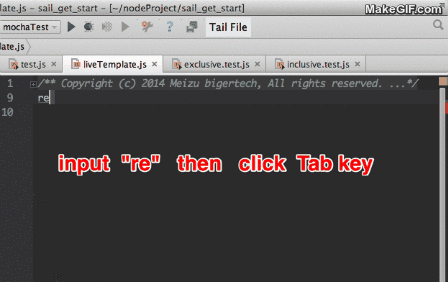
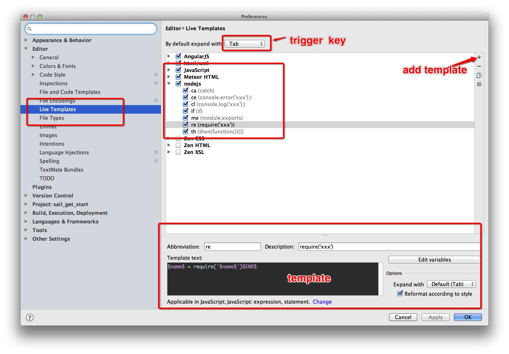

live-template
=============

webStrom IDEA , live template     example etc  
webStrom的实时代码模板。
### ^_^ 欢迎共享代码模板，提高开发效率


软件开发时，你经常要输入重复性的繁琐的代码，比如
`require`、`modelu.exports` 等等，  

有没有更加快捷的方式，让我们输入这些代码呢？

##有!

在笔者的开发环境中，只需要输入 `re` ，再按`tab`键，可以输出

```
module.exports = {
    //光标位置
}

```
###DEMO


光标位置又到可以编辑的位置，开发效率提升多少，可想而知了吧。

##配置步骤
1. 进入设置界面
2. 搜索 `Live Templates`
    结果页面就是实时模板的编辑界面
3.  * 点开 `javascript` ，点击右侧的 `+` 号，选择`live template`
    * 或者你可以选择 `template group` , 用来建立一个新的组
    比如 `nodejs`
5. 点击新建`live template`后，在新弹出的输入框中，
填入相应的数据
    * `abbreviation`
    * `description`  描述这个快捷模块的功能
    * `Template text` 模板代码
6. 输入框的下面有一个 蓝色的 `define` 选择，表示选择该模板的作用范围，将会在哪些文件中生效



## 语法说明
* `$VAR$`  可以定义一个变量
* `$ARRAY$` 可输入一个数组
* `$PARAM$`  可变长度参数
* `$END$`  光标结束符号


## 更多模板
javascript 或者 nodejs
### ce

输出错误信息  
```
console.error($err$);
```
### cl
输出log信息
```
console.log($END$);
```

### if

```
if ($PARAM$) {
  $END$
}
```

### me
模块导出

```
module.exports = {
    $END$
}
```

### re
引入模块
```
$name$ = require('$name$')$END$

```

### th
then 函数

```
then(function($PARAM$){
  $END$
});
```

### ca
捕获异常

```
catch(function(err){
  $END$
})
```

## 更多模板

### ^_^ 欢迎共享代码模板，提高开发效率
